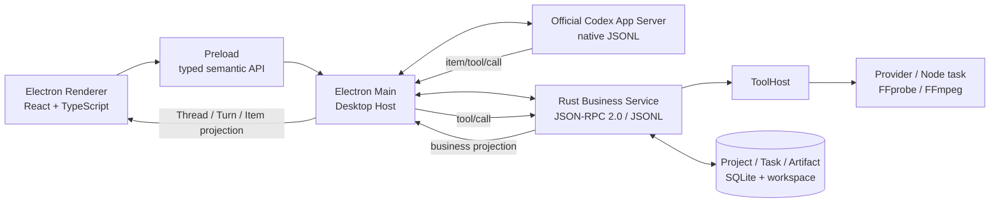
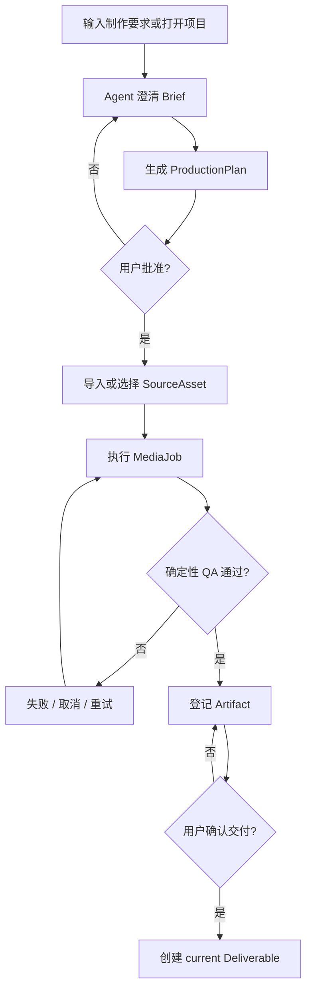

# LimeShot

[](https://github.com/limecloud/limeshot/actions/workflows/release.yml)

LimeShot 是面向内容生产者的独立桌面 AI 制作工作台。用户可以从自然语言需求或本地项目开始，由 Agent 收敛 Brief、生成可审阅的 ProductionPlan；用户批准后，Rust 业务服务负责受控任务、媒体处理、Artifact QA 和最终交付确认。

当前版本：`v0.3.0`。

## 产品范围

LimeShot 固定提供五类业务入口，但只使用一套 Agent runtime 和一套业务后端：

| Profile | GUI 名称 | 业务重点 |
| --- | --- | --- |
| `general` | 全能模式 | 通用策划、单项生成与多能力组合 |
| `short_form` | 短剧短片 | 剧本、分镜、素材组织与分集合成 |
| `visual_transform` | 转绘视频 | 源片分析、视觉转换与视频重生成 |
| `talking_video` | 口播视频 | 脚本、出镜人、声音、封面与混剪 |
| `commerce_video` | 电商视频 | 商品事实、卖点、商品资产与平台交付 |

`v0.3.0` 已打通以下 current 主链：

- Codex Conversation 的创建、18 类 Item 原序渲染、72 类 notification 语义投影、中断与 paginated history 恢复。
- Command/File/Permission Approval、RequestUserInput、MCP Elicitation 和多 Agent 子线程只读导航。
- Project、Brief、Conversation binding、ProductionPlan 和不可变 ApprovalReceipt。
- 素材导入、FFprobe 探测、FFmpeg MP4 转码、进度、取消、超时与重试。
- `media-output.v1`、`qa-report.v1`、Artifact lineage 与 Project 唯一 current Deliverable。
- `zh-CN`、`zh-TW`、`en-US`、`ja-JP`、`ko-KR` 五种界面语言。

远端图片、视频和语音 Provider 尚未接入生产配置。正式包也尚未携带可再分发的 FFmpeg/FFprobe runtime；缺少受管资源时相关服务会明确阻断，不会回退到系统 PATH 或 mock。

## 架构



核心边界：

- Codex App Server 是唯一 Agent runtime，拥有 Agent loop、Thread、Turn、Item、history、Skills、MCP、工具生命周期和恢复语义。
- Electron Main 直接拥有 Codex 与 Rust 两个平级子进程，以及两套独立协议 client；它不实现第二套业务后端。
- Rust Business Service 只拥有 Project、Brief、Plan、业务审批、Task、Provider、Cost、Artifact、Deliverable 和媒体执行。
- Renderer 只能调用 preload semantic API，不接触 raw Codex method、raw JSON-RPC、文件路径、Provider HTTP 或 FFmpeg argv。
- Codex reverse request 必须经过 Electron 路由到 Rust ToolHost，并接受 schema、Project scope、workspace grant、capability 与审批校验。

LimeShot 不使用 Tauri，也不依赖任何参考桌面应用。外部产品只用于研究交互和技术可行性，不是 LimeShot 的父产品、资源来源或运行时组成。

## 业务流程



Turn 完成、Task 成功、passing QA、Artifact 登记和 Deliverable 确认是不同事实。只有 GUI 中的用户明确确认才能创建最终交付物。

## 开发环境

当前主要开发和发布目标为 macOS Apple Silicon。

依赖：

- Node.js `22`
- npm（使用仓库内 `package-lock.json`）
- Rust stable toolchain
- OpenAI 官方 Codex `0.145.0` arm64 macOS binary

安装依赖：

```bash
npm ci
```

开发入口只接受 `resources/codex/manifest.v1.json` 声明且 hash、版本都匹配的官方 Codex。可以把 binary 放入 manifest 对应的默认目录，或显式提供绝对路径：

```bash
export LIMESHOT_CODEX_BIN="/absolute/path/to/codex-aarch64-apple-darwin"
npm run electron:dev
```

生产打包必须单独使用 `LIMESHOT_CODEX_PACKAGE_BIN`；缺失或校验失败会 fail closed。

## 验证

```bash
npm run verify:app-version
npm run typecheck
npm run test:contracts
npm test
npm run test:rust
npm run verify:gui-smoke
```

`npm run verify:gui-smoke` 是 Gate B：它必须证明真实 Electron、preload/IPC、Codex child、Rust business child、两条 stdio 协议、动态工具、Project binding、媒体执行和用户可见恢复状态。浏览器投影或 production mock 不能替代 Gate B。

完整本地门禁：

```bash
npm run verify:local
```

## 正式发布

`.github/workflows/release.yml` 是正式 Release 的唯一构建与发布 owner。推送 `v*` tag 后，GitHub Actions 会：

1. 校验 tag 与 `package.json` 版本一致，并创建或复用 draft Release。
2. 在 Node 22 / Rust stable 环境运行版本、类型、协议、前端和 Rust 门禁。
3. 在 `macos-15` arm64 runner 下载 manifest 固定的官方 Codex，并校验 archive SHA-256、executable SHA-256 和版本输出。
4. 使用 Electron Forge 构建 App、DMG 与 ZIP，验证 App 版本、内嵌 binary、codesign、DMG CRC 和 ZIP 完整性。
5. 生成并复验 `SHA256SUMS.txt`，通过 Actions Artifact 将产物交给独立 publish job。
6. 覆盖同版本 GitHub Release 资产，并在全部步骤成功后发布 Release。

开发机生成的包只用于本地验收，不得上传为正式 Release 资产。

## 仓库结构

| 路径 | Owner |
| --- | --- |
| `packages/codex-client/` | 固定上游 Codex 原生协议 client |
| `packages/business-client/` | Rust 业务 JSON-RPC client |
| `src/main/codex/` | Codex 进程、协议、工具路由与投影 |
| `src/main/business/` | Rust Business Service 监管 |
| `src/main/ipc.ts`、`src/preload/`、`src/shared/` | Renderer semantic command boundary |
| `src/renderer/` | GUI projection 与交互 |
| `rust/crates/` | 业务协议、项目、工具、Provider、媒体和 Artifact owner |
| `resources/` | Skills、catalog、contracts 与受管资源 manifest |
| `schemas/` | 业务协议和 Artifact schema |
| `internal/roadmap/v1/` | PRD、业务、协议、图册与执行路线图 |
| `internal/roadmap/xuanlan/` | Codex Item、Event 与交互全量投影合同 |

## 文档

- [产品需求](internal/roadmap/v1/PRD.md)
- [业务规格](internal/roadmap/v1/BUSINESS.md)
- [架构与流程图](internal/roadmap/v1/DIAGRAMS.md)
- [协议边界](internal/roadmap/v1/PROTOCOL.md)
- [资源迁移](internal/roadmap/v1/RESOURCE-MIGRATION.md)
- [全局架构](internal/aiprompts/architecture.md)
- [命令边界](internal/aiprompts/commands.md)
- [质量工作流](internal/aiprompts/quality-workflow.md)
- [执行计划](internal/exec-plans/v1-implementation.md)
- [对话全量投影方案](internal/roadmap/xuanlan/README.md)
- [v0.3.0 Release Notes](RELEASE_NOTES.md)

## License

[Apache License 2.0](LICENSE)
