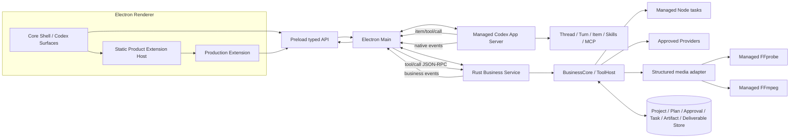
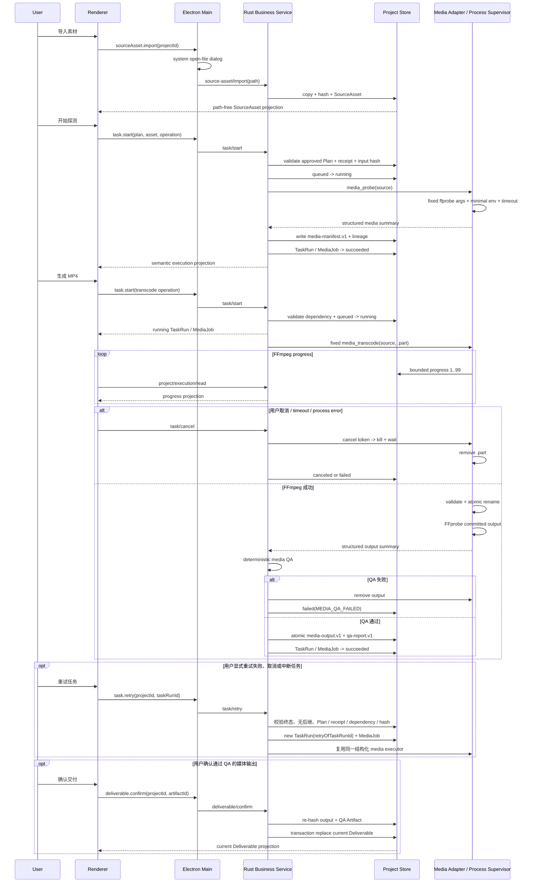

# LimeShot 全局架构

状态：`current / v1 implementation`
更新日期：`2026-07-31`

## 唯一产品链



Electron main 同时监管两个互不替代的后端：

1. Codex App Server：唯一 Agent runtime，直接使用固定版本上游协议。
2. Rust Business Service：唯一产品业务后端，使用 LimeShot 标准 JSON-RPC 2.0 协议。

Electron 只路由、投影和提供桌面能力；Rust 不包装 Codex，Codex 不直接拥有业务数据库或 Provider 凭证。

## Renderer Extension Boundary

Renderer 分成核心桌面壳和产品 extension 两层，两层都只能消费 preload 暴露的 typed semantic API：

```text
Core Shell
  -> AppSidebar
  -> ConversationTimeline
  -> PendingInteractions
  -> Composer / ConversationModelMenu
  -> ConversationReview(Diff workspace / File tree)
  -> ConversationStatusSurface(Activity popover)

Product Extension Host
  -> registry
  -> production
       -> ProductionHome
       -> ProductionWorkspace
            -> Brief / Plan / Execution / Artifact / Deliverable
```

- 核心壳只拥有窗口布局、导航、Codex 会话投影、阻塞交互、Composer、模型/推理强度选择、Review 工作区和独立 Activity 浮层。`ConversationModelMenu` 只消费 typed semantic API，目录来自 Codex `model/list`，设置通过 `thread/settings/update` 并由 `thread/settings/updated` 收敛；Rust Business Service 与产品 extension 不拥有模型状态。`ComposerHost` 独占系统文件/目录选择、应用窗口捕获和本地路径，Renderer 只持有不透明附件/能力 token；文件引用、`localImage`、`localAudio`、`plugin://` Mention、Goal 与 Plan mode 仅在 Main 校验后进入 Codex。Review 默认关闭；时间线 `fileChange` 行与工具栏“变更”只发出打开意图，文件选择、文件树和 diff 仅由 `ConversationReview` 拥有。Review 不承载 Environment/Runtime 状态，更不得承载 Project、Brief、Plan、Task、Artifact 或 Deliverable 业务界面。
- `src/renderer/src/extensions/{types,registry,ExtensionHost}.tsx?` 是静态可信 extension 装配边界；它只定义宿主上下文和选择组件，不拥有业务状态、协议或后端。
- `src/renderer/src/extensions/production/**` 是当前生产业务 UI 的唯一 owner，拥有独立 Home、Workspace、业务文案和样式。业务编辑打开独立主工作区，不挤入核心 Review 或 Activity surface。
- 核心可持有 `ProjectSummary` 作为侧栏导航和 Conversation scope 的不透明摘要；Project detail、Profile、Brief、Plan、Execution 与媒体业务状态必须在 production extension 内加载和投影。
- extension 不得调用 raw Codex/Rust method，不得读取文件路径或启动进程；所有能力仍经 preload typed gateway、Electron main 和既有后端 owner。
- Codex `plugin/list` 只为当前 Turn 提供上游能力 Mention，不等于 Renderer product extension。当前不建设可下载第三方插件、动态代码加载、权限沙箱或独立插件协议；新增产品 extension 只能显式注册并随应用构建，直到真实需求证明需要更复杂的插件系统。

## Agent Runtime Non-Reimplementation Contract

LimeShot 使用 Codex App Server，不实现、派生或镜像 Codex Agent Runtime。下列能力无条件归上游 Codex：

- agent loop、model loop 和 tool loop；
- Thread、Turn、Item、Conversation history 与 compaction；
- Skills、MCP、Codex 原生工具审批、sandbox 与 Multi-Agent；
- streaming delta、interrupt、resume、fork、archive 和 terminal state。

LimeShot 允许的代码只有：固定版本 protocol client、进程 supervisor、Renderer projection、Project binding 和 reverse-request route。任何新增 Rust 类型或数据库表若表达 Thread/Turn/Item/history，必须在评审中直接拒绝。

## Owner

| Domain | Current owner |
| --- | --- |
| Desktop lifecycle / semantic IPC | `src/main/**`、`src/preload/**` |
| Codex transport / native protocol | `src/main/codex/**`、`packages/codex-client/**` |
| Agent loop / Thread / Turn / Item | managed upstream Codex App Server |
| Skills discovery and execution | upstream Codex + `resources/skills/**` |
| Rust business transport / protocol | `src/main/business/**`、`packages/business-client/**`、`rust/crates/business-protocol/**` |
| Project / Brief / Conversation binding / Plan / ApprovalReceipt / Task / Artifact / Deliverable persistence | `rust/crates/projects/**` |
| Profile / business use-case / Task orchestration | `rust/crates/business-core/**` |
| Dynamic tool validation / dispatch | `rust/crates/tools/**` |
| Provider / cost / remote tasks | `rust/crates/providers/**` |
| FFprobe / FFmpeg jobs | `rust/crates/media/**` |
| Artifact contracts / lineage | `rust/crates/artifacts/**` |
| Renderer core shell / Codex projection / review workspace | `src/renderer/src/{App,AppSidebar,ConversationTimeline,ConversationModelMenu,PendingInteractions,ConversationReview,ConversationStatusSurface}.tsx` 及核心样式/文案 |
| Renderer product extension host | `src/renderer/src/extensions/{types,registry,ExtensionHost}.tsx?` |
| Production business projection | `src/renderer/src/extensions/production/**` |

## Data Ownership

```text
Codex store
  -> Thread / Turn / Item / history / model state

Rust business store
  -> Project / Brief / (projectId, conversationId) -> codexThreadId binding
  -> Plan / Approval / TaskRun / MediaJob / Cost
  -> SourceAsset / Artifact / Deliverable
```

- Rust 不保存完整 assistant/user message history。
- Electron 不维护可恢复的 Agent 状态机，只维护当前窗口所需的临时 view state。
- GUI reload 或 Codex crash 后，Electron 使用 Rust binding 找到 `codexThreadId`，再调用 Codex `thread/resume|read`。
- Codex 在首条用户消息前不会持久化空 Thread。Electron 同进程复用该 active Thread；冷启动收到上游明确的 unmaterialized 错误时创建替代 Thread，并通过 `expectedCodexThreadId` compare-and-swap 更新 Rust binding。Rust 不判断 Codex 生命周期。
- Task 终态来自 Rust executor/reconcile；Turn 终态来自 Codex `turn/completed`，两者不能互相替代。
- 外部素材只能由 Electron 系统文件选择能力导入；Rust 将其复制到 Project 受管 workspace，Renderer 只接收无原始路径的 `SourceAsset` 投影。
- `task/start`、`task/cancel` 与 `task/retry` 是 GUI 明确动作，不进入 Codex dynamic tool catalog。Rust 必须校验 Plan、operation、依赖、ApprovalReceipt、素材 hash 和受管 runtime，随后独立持久化 `TaskRun / MediaJob / Artifact`。
- 当前媒体 operation 是同步 `media_probe` 与后台 `media_transcode`。探测成功产生 `media-manifest.v1`；转码使用 Rust 固定 MP4 参数、只写 `.part`，进程成功后原子提交，再由 FFprobe 执行确定性 QA。只有 QA 通过才在同一事务登记 `media-output.v1 + qa-report.v1` 并将 TaskRun/MediaJob 标为 succeeded；QA 失败删除输出并记录 `MEDIA_QA_FAILED`。所有 Artifact 都记录 `SourceAsset -> Plan version -> ApprovalReceipt -> TaskRun -> MediaJob -> Artifact` lineage。
- retry 不修改旧 TaskRun，也不创建 workflow DAG。只有 `failed/canceled/interrupted` 可重试；每次重试重新校验当前 Plan、批准凭证、依赖、素材 hash 和 runtime，创建带 `retryOfTaskRunId` 的新 TaskRun/MediaJob。一个失败节点最多有一个直接后继，后续失败从最新节点继续形成线性链。
- Task succeeded、passing QA、Artifact 和 Deliverable 是四类独立事实。`deliverable/confirm` 只能由 GUI 用户动作触发，不进入 Codex dynamic tool catalog；Rust 在确认时重新校验 output/QA Artifact 的大小和 SHA-256，并在事务中保留历史记录、切换 Project 唯一 current Deliverable。
- Codex 原生工具审批属于 Agent runtime；ProductionPlan、成本、素材授权和覆盖等业务审批属于 Rust，二者不得共享状态或协议。

## Process Rules

- Electron main 分别启动 Rust Business Service 与 Codex；Rust 不能成为 Codex 父进程或 proxy。
- 每个 Electron 实例最多一个 Rust Business Service 和一个按首次 Conversation 惰性启动的 Codex App Server；Codex 启动后由 Electron 复用。
- Codex stdout 与 Rust stdout 分别使用独立 parser、pending map、timeout 和日志前缀。
- Codex stdout 只解析原生协议，Rust stdout 只解析标准 JSON-RPC 2.0。
- Codex 意外退出时 pending request 失败、活跃 Turn 显示 interrupted；重启后按 binding resume/read。
- Rust 意外退出时业务 request 失败、活跃本地任务进入 reconcile；不得影响 Codex history 真实性。
- Rust repository 打开时将遗留 `queued/running` 本地任务原子改为 `interrupted`；不会根据聊天文本、Turn 状态或缓存推断任务成功。
- Codex、Node、FFmpeg 只能从受管目录启动，不继承参考应用路径或 PATH fallback。开发入口在启动前校验仓库受管 Codex release 的版本和 SHA-256；开发态可显式复用本机 `CODEX_HOME` 完成已登录账号调试，打包产品仍使用应用自己的 user-data Codex home。
- 开发与 Gate B 可通过绝对路径 `LIMESHOT_FFPROBE_BIN`、`LIMESHOT_FFMPEG_BIN` 注入测试/开发 runtime；打包应用忽略这些变量，只接受资源 manifest 校验通过的受管文件。缺失时对应 media service 保持 blocked；完整性或访问错误不能被降级为普通 missing。

## Managed Media Sequence



## Architecture Confirmation

- [x] Codex App Server 是唯一 Agent runtime。
- [x] Electron main 直接拥有 Codex 子进程及原生协议连接。
- [x] Rust Business Service 不依赖 Codex protocol/type/crate。
- [x] Rust 只保存 Project 与 Codex Thread 的标识绑定。
- [x] Codex reverse request 经 Electron 路由到 Rust ToolHost。
- [x] Renderer 只消费 semantic projection。
- [x] Renderer 核心壳与 production extension 已分离；核心 Review 只拥有 Diff 与文件树，Activity 由对话内独立浮层拥有。
- [x] 模型目录与 Thread model/effort 设置归 Codex；Renderer 只走 typed semantic API，Rust 业务层与 extension 不绑定该能力。
- [x] Composer 文件/目录/图片/音频/窗口截图、Goal、Plan mode 与 Plugin 只走 typed semantic API -> Electron Main -> Codex；Renderer 无路径、raw method 或第二套 Skill/Plugin runtime。
- [x] Project、Profile、Brief、Plan、Execution、Artifact 与 Deliverable 业务 UI 只由 `extensions/production/**` 拥有，项目编辑进入独立 extension workspace。
- [x] Extension host 采用随应用构建的静态可信 registry；不引入动态第三方代码加载、第二套协议或第二个业务后端。
- [x] 不引入 Tauri、生产 mock、系统 PATH fallback或参考应用资源依赖。
- [x] direct Codex + Rust business 双进程 Gate B 技术证据已完成，包含 `project_read`、`plan_create`、GUI 审批、`ApprovalReceipt`、多项目同名默认会话、空会话冷启动恢复与历史恢复。
- [x] 首个 `media_probe` 竖切通过真实 Electron Gate B：系统文件选择、受管 workspace 复制、结构化进程 argv、Task/Job/Artifact 持久化、lineage 与完整重启恢复均有证据。
- [x] 首个 `media_transcode` 竖切通过真实 Electron Gate B：后台进度、GUI 取消、固定 argv、`.part` 原子提交/清理、进程回收、`media-output.v1` lineage 与冷重启恢复均有证据。
- [x] 确定性媒体 QA 与用户确认 Deliverable 通过真实 Electron Gate B：`qa-report.v1`、semantic confirm、唯一 current、文件 hash 复验及冷启动恢复均有证据。
- [x] 该业务执行链不新增 Codex tool，不从 Turn 或聊天文本推断 Task 状态。
- [x] 责任开发者已确认：本变更没有新增 Agent runtime、workflow DAG、Renderer raw bridge 或第二套业务后端。
