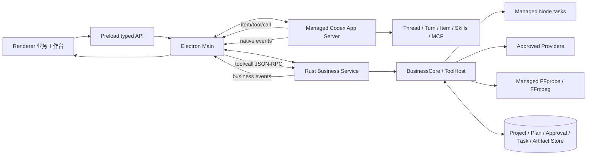

# LimeShot 全局架构

状态：`current / v1 implementation`
更新日期：`2026-07-28`

## 唯一产品链



Electron main 同时监管两个互不替代的后端：

1. Codex App Server：唯一 Agent runtime，直接使用固定版本上游协议。
2. Rust Business Service：唯一产品业务后端，使用 LimeShot 标准 JSON-RPC 2.0 协议。

Electron 只路由、投影和提供桌面能力；Rust 不包装 Codex，Codex 不直接拥有业务数据库或 Provider 凭证。

## Agent Runtime Non-Reimplementation Contract

LimeShot 使用 Codex App Server，不实现、派生或镜像 Codex Agent Runtime。下列能力无条件归上游 Codex：

- agent loop、model loop 和 tool loop；
- Thread、Turn、Item、Conversation history 与 compaction；
- Skills、MCP、Codex 原生工具审批、sandbox 与 Multi-Agent；
- streaming delta、interrupt、resume、fork、archive 和 terminal state。

LimeShot 允许的代码只有：固定版本 protocol client、进程 supervisor、Renderer projection、Project binding 和 reverse-request route。任何新增 Rust 类型或数据库表若表达 Thread/Turn/Item/history，必须在评审中直接拒绝。

## Owner

| Domain | Current owner |
| --- | --- |
| Desktop lifecycle / semantic IPC | `src/main/**`、`src/preload/**` |
| Codex transport / native protocol | `src/main/codex/**`、`packages/codex-client/**` |
| Agent loop / Thread / Turn / Item | managed upstream Codex App Server |
| Skills discovery and execution | upstream Codex + `resources/skills/**` |
| Rust business transport / protocol | `src/main/business/**`、`packages/business-client/**`、`rust/crates/business-protocol/**` |
| Project / Brief / Conversation binding / Plan / ApprovalReceipt | `rust/crates/projects/**` |
| Profile / business use-case / Task orchestration | `rust/crates/business-core/**` |
| Dynamic tool validation / dispatch | `rust/crates/tools/**` |
| Provider / cost / remote tasks | `rust/crates/providers/**` |
| FFprobe / FFmpeg jobs | `rust/crates/media/**` |
| Artifact contracts / lineage | `rust/crates/artifacts/**` |
| User projection | `src/renderer/**` |

## Data Ownership

```text
Codex store
  -> Thread / Turn / Item / history / model state

Rust business store
  -> Project / Brief / (projectId, conversationId) -> codexThreadId binding
  -> Plan / Approval / Task / Cost
  -> Asset / Artifact / Deliverable
```

- Rust 不保存完整 assistant/user message history。
- Electron 不维护可恢复的 Agent 状态机，只维护当前窗口所需的临时 view state。
- GUI reload 或 Codex crash 后，Electron 使用 Rust binding 找到 `codexThreadId`，再调用 Codex `thread/resume|read`。
- Codex 在首条用户消息前不会持久化空 Thread。Electron 同进程复用该 active Thread；冷启动收到上游明确的 unmaterialized 错误时创建替代 Thread，并通过 `expectedCodexThreadId` compare-and-swap 更新 Rust binding。Rust 不判断 Codex 生命周期。
- Task 终态来自 Rust executor/reconcile；Turn 终态来自 Codex `turn/completed`，两者不能互相替代。
- Codex 原生工具审批属于 Agent runtime；ProductionPlan、成本、素材授权和覆盖等业务审批属于 Rust，二者不得共享状态或协议。

## Process Rules

- Electron main 分别启动 Rust Business Service 与 Codex；Rust 不能成为 Codex 父进程或 proxy。
- 每个 Electron 实例最多一个 Rust Business Service 和一个按首次 Conversation 惰性启动的 Codex App Server；Codex 启动后由 Electron 复用。
- Codex stdout 与 Rust stdout 分别使用独立 parser、pending map、timeout 和日志前缀。
- Codex stdout 只解析原生协议，Rust stdout 只解析标准 JSON-RPC 2.0。
- Codex 意外退出时 pending request 失败、活跃 Turn 显示 interrupted；重启后按 binding resume/read。
- Rust 意外退出时业务 request 失败、活跃本地任务进入 reconcile；不得影响 Codex history 真实性。
- Codex、Node、FFmpeg 只能从受管目录启动，不继承参考应用路径或 PATH fallback。开发入口在启动前校验仓库受管 Codex release 的版本和 SHA-256；开发态可显式复用本机 `CODEX_HOME` 完成已登录账号调试，打包产品仍使用应用自己的 user-data Codex home。

## Architecture Confirmation

- [x] Codex App Server 是唯一 Agent runtime。
- [x] Electron main 直接拥有 Codex 子进程及原生协议连接。
- [x] Rust Business Service 不依赖 Codex protocol/type/crate。
- [x] Rust 只保存 Project 与 Codex Thread 的标识绑定。
- [x] Codex reverse request 经 Electron 路由到 Rust ToolHost。
- [x] Renderer 只消费 semantic projection。
- [x] 不引入 Tauri、生产 mock、系统 PATH fallback或参考应用资源依赖。
- [x] direct Codex + Rust business 双进程 Gate B 技术证据已完成，包含 `project_read`、`plan_create`、GUI 审批、`ApprovalReceipt`、多项目同名默认会话、空会话冷启动恢复与历史恢复。
- [ ] 责任开发者完成架构确认。
