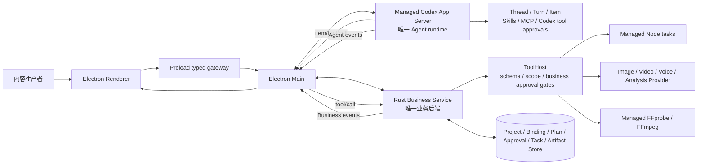
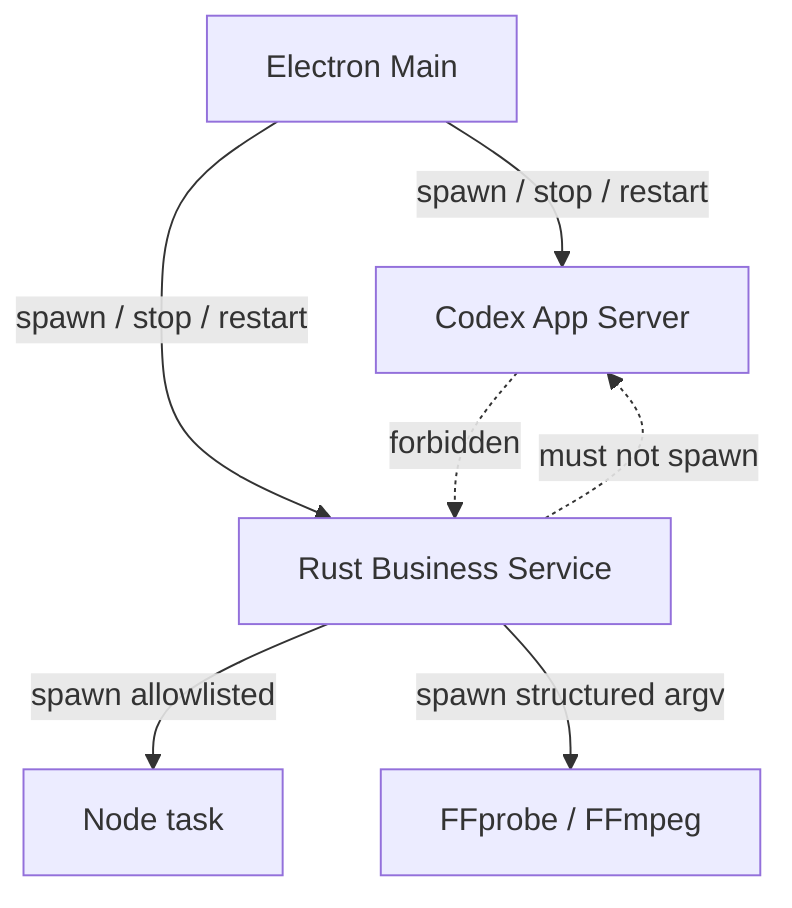
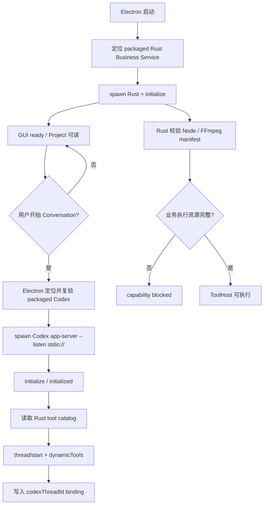
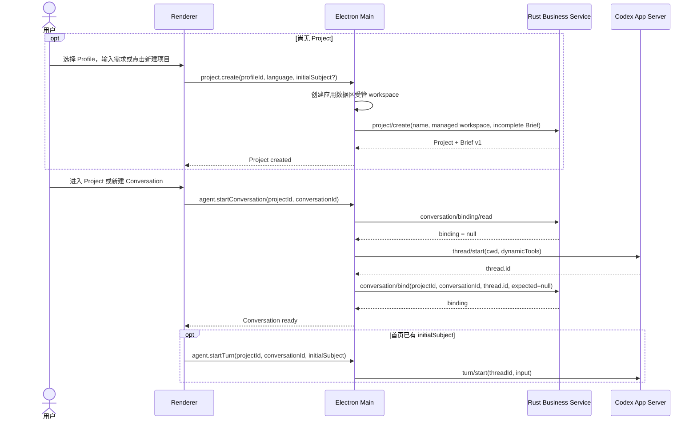
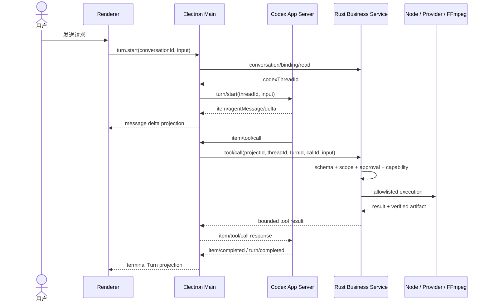
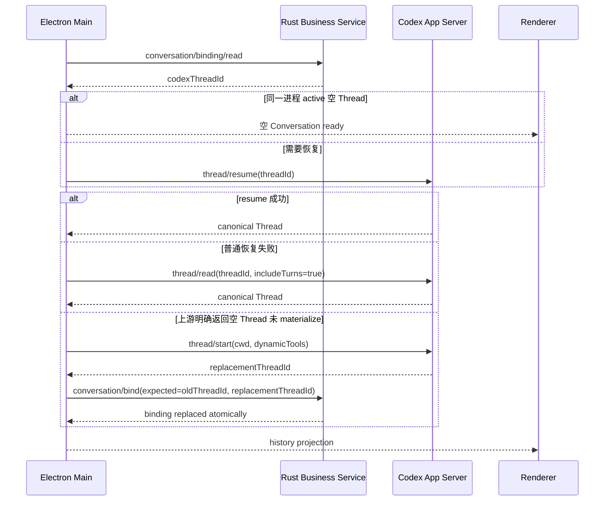
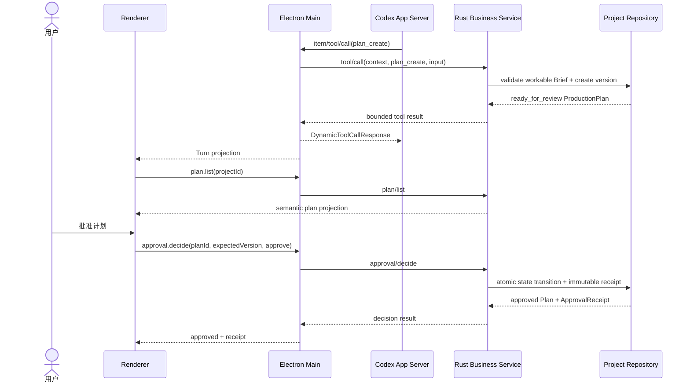
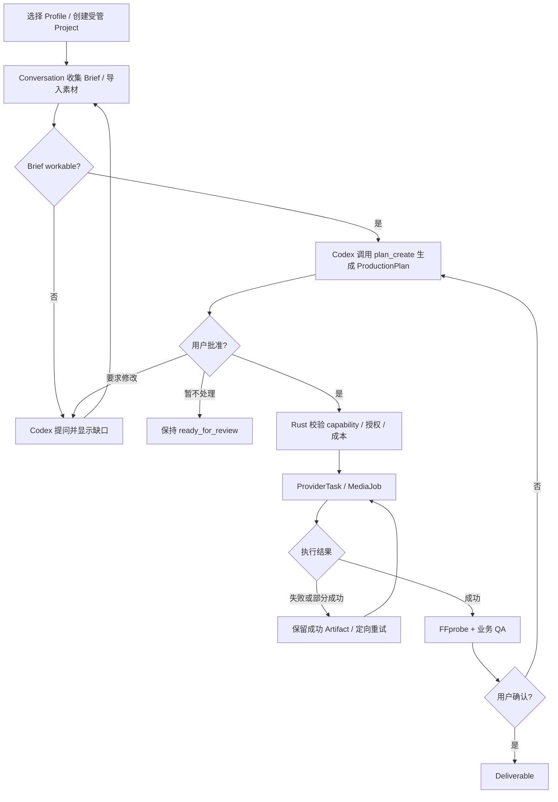

# LimeShot v1 架构与流程图册

状态：`current / canonical`
日期：`2026-07-28`
关联文档：[PRD.md](./PRD.md)、[README.md](./README.md)、[PROTOCOL.md](./PROTOCOL.md)

## 1. 总体架构图

Electron 直接连接 Codex，不经过 Rust。Rust 不实现 Agent runtime，只承接产品业务与工具执行。

## 2. 进程所有权图

Codex 和 Rust 是 Electron 的平级受管子进程。这样可以从进程拓扑上阻止 Rust 包装 Codex并演变为第二套 runtime。

## 3. 启动与资源流程图

Codex 按首次 Conversation 惰性启动，最终解析和 spawn 只归 Electron；Node/FFmpeg 的安装与执行归 Rust ToolHost。任一步失败都进入 blocked，不回退系统 PATH 或其他应用资源。

## 4. 新建 Project / Conversation 时序图

Renderer 不提交任意 workspace path，也不显示自定义项目表单。Electron 在应用数据区分配受管 workspace；Rust 创建 Project/Brief 并只保存 `thread.id` 绑定，不保存 Thread 内容。系统目录选择器只属于未来明确的外部目录导入入口，不得出现在“新建项目”。

## 5. Turn 与动态工具时序图

`turn/completed` 是 Turn 终态；Task/Artifact 终态来自 Rust。任何一侧都不能合成另一侧的终态。

## 6. 恢复时序图

禁止从 Rust message table、缓存 delta 或固定 timeout 重建 Codex Thread。`conversationId` 只在 Project 内唯一；空 Thread 替换必须 compare-and-swap，不能覆盖已被其他请求更新的 binding。Phase 4 落地 Task repository 后，业务任务恢复另走 Rust `task/reconcile`，不混入 Codex history 恢复。

## 7. ProductionPlan 与业务审批时序图

计划创建只能走 `plan_create -> tool/call -> ToolHost`；计划审批只能由 GUI 用户动作进入 `approval/decide`。Agent 不拥有 `plan_approve` 工具，也不能把自然语言确认解释为业务批准。

## 8. 业务生产流程图

## 9. 阅读规则

- 总体架构图回答系统组成。
- 进程图回答谁能启动谁。
- 启动图回答受管资源如何准备。
- Conversation、Turn 和恢复图回答 Codex 与 Rust 如何分工。
- ProductionPlan 时序图回答 Agent 创建与用户审批为何是两条独立入口。
- 业务图回答从 Brief 到 Deliverable 的成功条件。
