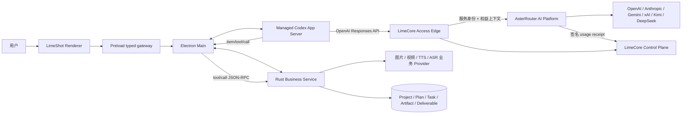
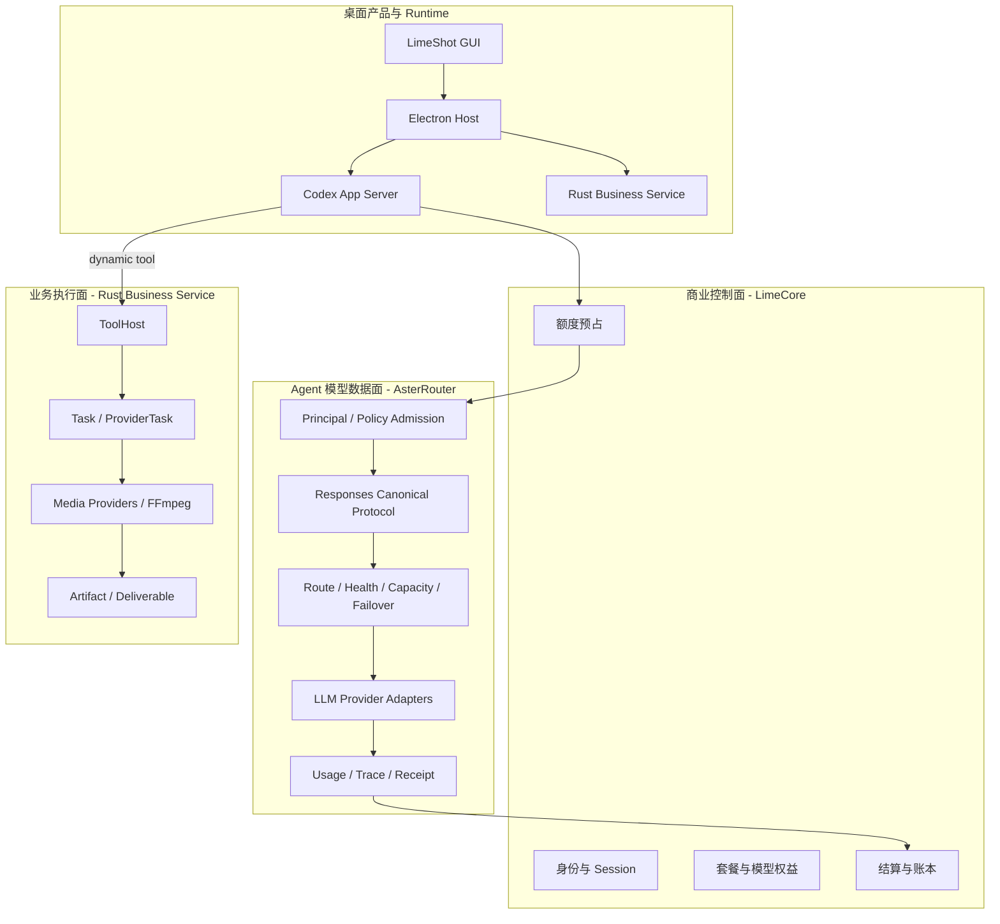
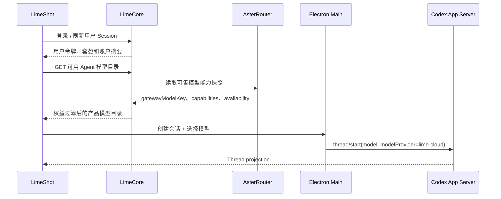
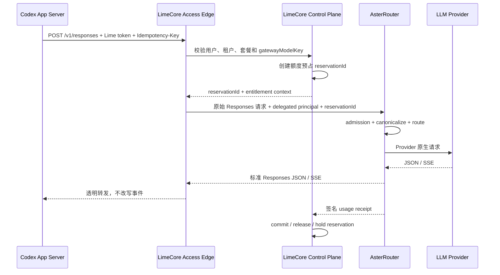
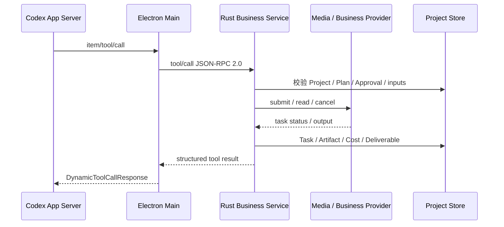
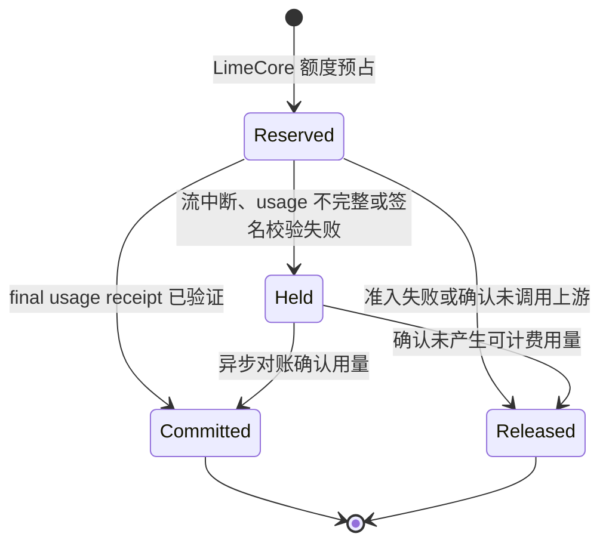

# LimeShot 云端多模型平台架构

状态：`target / architecture decision confirmed`

决策日期：`2026-07-29`

适用范围：LimeShot、受管 Codex App Server、Rust Business Service、LimeCore 与 AsterRouter 组成的桌面 Agent 和云托管模型调用链。

## 1. 决策结论

LimeShot 不重写 Codex Agent Runtime，也不在桌面端实现 Claude、Gemini、Grok、Kimi、DeepSeek 等 Agent 模型协议。系统按桌面运行时、本地业务后端、用户商业控制面和云端模型数据面分离：

- LimeShot Renderer、Preload 和 Electron Main 负责桌面产品、进程监管、语义 IPC 和投影，不承接第二套业务或 Agent 后端。
- 受管 Codex App Server 是唯一 Agent Runtime，负责 Agent loop、Thread / Turn / Item、工具、MCP、Skills、Multi-Agent、历史恢复和上下文管理。
- Rust Business Service 是唯一桌面产品业务后端，负责 Project、Profile、Brief、Plan、业务审批、Task、Artifact、Deliverable 和图片/视频/语音业务任务。
- LimeCore 是用户与商业事实源，负责用户、租户、登录、订阅、套餐、Agent 模型权益、额度预占、结算和账本。
- AsterRouter 是云端 Agent 模型网关唯一 owner，负责协议归一、Provider 路由、健康与容量、故障切换、流式事件、错误和 usage 标准化。
- Agent 模型上游凭证只进入 AsterRouter 或其 Secret Store，不进入 LimeShot、Codex input、Rust Business Store 或 LimeCore。

首期 Agent 模型链路固定为：

```text
LimeShot / Codex App Server
  -> LimeCore Access Edge: 用户鉴权、模型权益、额度预占
  -> AsterRouter AI Platform Data Plane: Responses 网关与 Provider 路由
  -> OpenAI / Anthropic / Gemini / xAI / Kimi / DeepSeek / 其他上游
  -> AsterRouter: 标准 Responses SSE + 签名 usage receipt
  -> LimeCore: 提交、释放或挂起额度预占
  -> Codex App Server
  -> Thread / Turn / Item projection
  -> LimeShot GUI
```

LimeCore 可以保留 `llm.limeai.run` 公网入口和透明流式代理，但不得继续拥有 Provider adapter、协议转换、模型路由或上游重试。是否经过 LimeCore 不改变 AsterRouter 作为 Agent 模型数据面唯一 owner 的结论。

## 2. 目标与非目标

### 2.1 目标

1. 不修改 Codex Agent loop 即可在 LimeShot 中使用 Claude、Gemini、Grok、Kimi、DeepSeek 等模型。
2. 让 Codex 始终消费 OpenAI Responses API，由 AsterRouter 消化真实供应商差异。
3. 保留 LimeCore 已有的用户、套餐、Token 积分、额度预占和账本闭环。
4. 保留 Rust Business Service 的本地业务编排、媒体任务和 Artifact 事实源。
5. 保证模型请求、流式响应、错误和 usage 跨服务后仍可追踪、幂等和对账。
6. 为 macOS arm64 与 Windows x64 使用同一协议和凭证边界。

### 2.2 非目标

- 不在 Electron、Renderer 或 Rust Business Service 内实现 Agent 模型 Provider adapter。
- 不复制 Codex 的 Agent loop、工具状态机、Thread history、MCP 或 Skills Runtime。
- 不让 AsterRouter 创建 Lime 最终用户、登录 Session、订阅、订单、余额或积分账本。
- 不让 LimeCore 继续演进第二套模型协议转换和 Provider 路由。
- 不把图片、视频、TTS、ASR 等业务 Provider 错误地迁入 Agent 模型网关。
- 首期不让 Codex 使用 LimeCore 签发的短期令牌直连 AsterRouter。

## 3. 系统上下文



系统仍只有一条 Agent 产品主链：

```text
Electron Renderer
  -> preload typed gateway
  -> Electron Main
  -> managed Codex App Server
  -> OpenAI Responses-compatible cloud provider
  -> LimeCore Access Edge
  -> AsterRouter
  -> upstream model
  -> Codex Thread / Turn / Item
  -> Electron semantic projection
  -> GUI
```

业务工具使用独立链路：

```text
Codex item/tool/call
  -> Electron Main route
  -> Rust Business Service JSON-RPC 2.0
  -> ToolHost / BusinessCore
  -> media or business Provider
  -> Task / Artifact / Deliverable projection
```

两条链在 Codex dynamic tool 边界协作，但不共享协议、状态机或持久化事实。

## 4. 职责与唯一 Owner

| 领域 | 唯一 Owner | 职责 | 明确禁止 |
| --- | --- | --- | --- |
| 桌面产品 | LimeShot Renderer / Preload / Electron Main | GUI、语义 IPC、进程监管、投影、OS 能力 | Provider 协议转换、业务数据库、第二 Agent Runtime |
| Agent Runtime | 受管 Codex App Server | Agent loop、Thread / Turn / Item、工具、MCP、Skills、Multi-Agent、历史恢复 | Lime 用户套餐、Project、Task 和 Artifact |
| 本地产品业务 | Rust Business Service | Project、Brief、Plan、业务审批、Task、Artifact、Deliverable、媒体任务 | Agent Thread history、LLM protocol gateway、Lime 用户订阅 |
| 用户与商业控制面 | LimeCore | 用户、租户、Session、订阅、订单、套餐、Agent 模型权益、预占、结算、账本 | Agent 模型 Provider Secret、协议适配、模型健康与故障切换 |
| 公网商业入口 | LimeCore Access Edge | 用户鉴权、模型权益检查、额度预占、请求关联、透明 SSE 代理 | Provider 选择、响应重编码、上游重试、流式语义修复 |
| Agent 模型数据面 | AsterRouter | Canonical request、Provider adapter、模型路由、健康、容量、熔断、重试、SSE、错误、usage receipt | Lime 最终用户、订阅、订单、余额、Project 或 Artifact |
| Agent 模型凭证 | AsterRouter Secret Store | 上游 API Key、OAuth/服务凭证、轮换和审计 | 下发给 LimeCore 或 LimeShot |
| 媒体业务 Provider | `rust/crates/providers` | 图片、视频、TTS、ASR、分析等业务任务的 adapter 与成本 | Claude/Gemini 等 Agent 对话模型网关 |

### 4.1 两类 Provider 必须分开

LimeShot 中存在两种用途完全不同的 Provider：

1. Agent 模型 Provider
   - 请求发起者是 Codex Runtime。
   - 统一 wire contract 是 OpenAI Responses API。
   - 云端协议转换和路由只归 AsterRouter。
   - Claude、Gemini、Grok、Kimi、DeepSeek 对 Codex 来说都是同一 `lime-cloud` Provider 下的模型。

2. 业务任务 Provider
   - 请求发起者是 Rust Business Service 的 ToolHost。
   - 服务对象是图片、视频、口播、TTS、ASR、素材分析等长任务。
   - 状态事实是 TaskRun / ProviderTask / Artifact，不是 Codex Turn。
   - 继续遵循 `internal/roadmap/v1/PROVIDER-ARCHITECTURE.md`，不能因 Agent 多模型架构而删除。

因此，本架构不会把 LimeShot 后端业务逻辑抽空。Rust Business Service 继续拥有本地产品业务；LimeCore 只补充远端用户与商业控制面；AsterRouter 只处理 Agent 模型数据面。

## 5. 平面划分



## 6. 核心调用流程

### 6.1 登录、模型目录和 Thread 创建



模型目录不是一份数据的双写：

- LimeCore 持有产品模型名、展示、套餐可见性、价格和用户权益。
- AsterRouter 持有 gateway model、上游 model、Provider account、能力、健康、容量和路由。
- 两者通过稳定的 `gatewayModelKey` 关联；LimeCore 不引用 Provider account 或上游密钥。
- LimeShot Renderer 不维护独立云端模型目录；离线展示只能使用明确标记的缓存快照。
- Rust `provider/capability/list` 是媒体业务能力目录，不得被复用为 Agent 模型目录。

Codex 的 `modelProvider` 按 Thread 选择。新 Thread 必须显式传入权益允许的 `model` 和 `modelProvider=lime-cloud`；后续 Turn 只在同一 Provider 信任边界内切换模型。Renderer 不能通过本地字符串替换伪造模型切换。

### 6.2 Agent 模型请求与流式响应



请求链必须满足：

1. LimeCore 在调用 AsterRouter 前完成用户鉴权、模型权益检查和额度预占。
2. LimeCore 只读取准入所需的稳定元数据；请求正文和 SSE 事件语义归 AsterRouter。
3. AsterRouter 只能在 Codex 尚未收到用户可见事件前执行安全重试或故障切换。
4. 首个用户可见事件发出后不得跨 Provider 重放，避免重复正文和工具副作用。
5. AsterRouter 对外恢复为标准 Responses 事件；Codex 不感知真实上游协议。
6. LimeCore 必须透明转发 SSE，不能缓冲完整响应后再发送，也不能重新编码事件。

### 6.3 业务工具调用



Agent 模型 usage 由 AsterRouter 和 LimeCore 结算；媒体业务任务 cost 由 Rust Business Service 的 Cost / Task / Artifact 事实记录。两种费用可以在用户账单层聚合，但不得共享一次请求的幂等键、状态机或数据库表。

### 6.4 结算与补偿



AsterRouter 返回的 Agent 模型 usage receipt 至少包含：

| 字段 | 说明 |
| --- | --- |
| `receiptId` | receipt 的全局稳定标识 |
| `requestId` | AsterRouter 请求标识 |
| `idempotencyKey` | 端到端幂等键 |
| `reservationId` | LimeCore 额度预占标识 |
| `tenantId` / `principalId` | AsterRouter AI Platform 调用方，不是 Lime 用户对象副本 |
| `gatewayModelKey` | LimeCore 与 AsterRouter 的稳定模型关联键 |
| `upstreamModel` | 实际执行模型，仅用于审计和成本核算 |
| `providerId` | 实际 Provider 路由标识，不下发给普通客户端 |
| `inputTokens` / `outputTokens` | 标准化 Token 用量 |
| `status` | `completed`、`upstream_error`、`cancelled` 或 `uncertain` |
| `startedAt` / `completedAt` | 请求时间边界 |
| `signature` / `keyId` | AsterRouter 对 receipt 的签名和轮换键标识 |

同一 `reservationId + idempotencyKey` 的重复 receipt 必须幂等。LimeCore 只根据已验证 receipt 提交最终账本；无法确认的用量进入 `Held` 和异步对账，不能静默按零用量退款。

## 7. 鉴权与凭证边界

### 7.1 首期 Agent 模型鉴权

```text
LimeShot Desktop
  -- Lime user/API token -->
LimeCore Access Edge
  -- service identity + delegated claims -->
AsterRouter AI Platform
  -- Agent model provider credential -->
LLM upstream
```

- Lime 用户令牌只由 LimeCore 签发和验证。
- LimeShot 只通过 macOS Keychain、Windows Credential Manager/DPAPI 对应的统一安全存储保存用户令牌。
- Electron Main 是桌面 credential broker；Renderer、Codex input 和 Rust Business Store 不读取明文令牌。
- LimeCore 到 AsterRouter 使用独立服务身份，采用短期 JWT/JWKS、HMAC 或 mTLS；不得透传 Lime 用户密码或 Provider Secret。
- delegated claims 只携带调用所需的 tenant、principal、model allowlist、reservation 和 request identity。
- AsterRouter 按 AI Platform 模式建模非人类 Principal，不复制 Lime 用户、Session、订阅或余额。

媒体业务 Provider 凭证继续遵循 Rust Business Service 的 Provider 架构和 Electron credential broker，不与 Agent 模型凭证共用命名、表或 Secret reference。

### 7.2 后续可选直连

未来可以让 LimeCore 签发短期 delegated JWT，由 Codex 直连 AsterRouter：

```text
Codex App Server -> AsterRouter -> upstream
                          |
                          +-> usage receipt -> LimeCore
```

该路径只有在令牌刷新、撤销、额度强一致、失败补偿和 Codex Provider 凭证刷新全部完成后才能启用。首期不得为了少一层代理牺牲计费闭环。

## 8. Codex 与协议边界

受管 Codex 自定义 Provider 的云端契约固定为 OpenAI Responses API：

```toml
[model_providers.lime-cloud]
name = "Lime Cloud"
base_url = "https://llm.limeai.run/v1"
env_key = "LIMESHOT_CLOUD_API_KEY"
wire_api = "responses"
```

该片段只表达目标协议，不授权把长期用户令牌写入 `config.toml`。实际凭证必须由 Electron credential broker 安全注入，且需要设计刷新与撤销流程。

AsterRouter 内部执行：

```text
OpenAI Responses request
  -> canonical request/content/tools
  -> route selected upstream protocol
       -> OpenAI Responses / Chat
       -> Anthropic Messages
       -> Gemini GenerateContent
       -> compatible Grok / Kimi / DeepSeek protocol
  -> canonical stream/error/usage
  -> OpenAI Responses response events
```

工具调用、reasoning、图片和其他 message part 只有在 AsterRouter capability 明确支持且转换无损时才允许进入对应模型。无法保持 Codex 语义的模型必须在请求上游前 fail closed，不能静默丢字段。

LimeShot 只使用固定 Codex 版本已导出的 typed method：

- `model/list`
- `modelProvider/capabilities/read`
- `thread/start.model`
- `thread/start.modelProvider`
- `thread/resume.model`
- `thread/resume.modelProvider`
- `turn/start.model`

Provider 选择是 Thread 级配置；`turn/start` 不承担跨 Provider 切换。LimeShot 不修改 Codex wire schema，也不通过 Rust JSON-RPC 包装 Codex 请求。

## 9. 失败与重试语义

| 场景 | Owner | 处理 |
| --- | --- | --- |
| 用户令牌无效 | LimeCore | 在预占前拒绝 |
| 套餐或 Agent 模型无权限 | LimeCore | 在预占前拒绝，返回稳定产品错误 |
| 额度不足 | LimeCore | 不调用 AsterRouter |
| AsterRouter admission 拒绝 | AsterRouter | 返回标准 Responses 错误；LimeCore 释放预占 |
| Provider 不健康或限流 | AsterRouter | 首个可见事件前按路由策略重试/切换 |
| SSE 已输出后断流 | AsterRouter + LimeCore | 不重放；receipt 标记 `uncertain`，预占进入 Held |
| receipt 签名无效 | LimeCore | 不结算、不退款，进入 Held 并告警 |
| LimeCore 回写暂时失败 | LimeCore worker | 按 `receiptId` 幂等重试 |
| 用户中断 Turn | Codex + AsterRouter | 传播取消；按已确认 usage 结算 |
| Rust 业务任务失败 | Rust Business Service | 按 Task / ProviderTask reconcile，不修改 Codex Turn 终态 |

错误对 Codex 统一为 Responses-compatible envelope，并保留稳定产品错误码和 `requestId`。Provider 原始错误、账号、密钥、内部路由和供应成本不能直接进入 Renderer。

## 10. 可观测性与数据保护

Agent 模型链统一携带：

- `traceId`
- `requestId`
- `idempotencyKey`
- `reservationId`
- `tenantId`
- `principalId`
- `gatewayModelKey`
- `codexThreadId`
- `codexTurnId`

默认日志只记录请求元数据、路由结果、状态、延迟和 usage，不记录完整 prompt、response、工具参数、图片正文或凭证。需要内容级诊断时必须经过显式授权、脱敏、限时保留和审计。

各系统分别持有自己的事实：

- Codex store：Thread / Turn / Item、history 和 Agent model state。
- Rust Business Store：Project、Conversation binding、Plan、Approval、Task、Artifact、Deliverable 和媒体成本。
- LimeCore：用户获得的产品权益、额度预占和最终扣费。
- AsterRouter：gateway model 的实际路由、技术用量和上游成本。

系统通过稳定 identity 关联，不互相复制完整业务对象、对话正文或数据库记录。

## 11. LimeShot 当前差距

以下是 2026-07-29 的真实实现状态，不得把 Target 文档误写为已完成：

1. `src/main/codex/supervisor.ts` 当前优先使用 `LIMESHOT_CODEX_HOME`、`CODEX_HOME` 或共享 `~/.codex`，尚未生成受 LimeCore 用户态管理的独立云端 Provider 配置。
2. `src/main/ipc.ts` 的独立会话和 Project 会话 `thread/start` 尚未传 `model` 或 `modelProvider`。
3. 固定 Codex 生成类型已包含模型相关 method 和字段，但 LimeShot 的窄 `CodexRequestMap` 尚未开放 `model/list` 与 `modelProvider/capabilities/read` 产品调用链。
4. Electron 对 `account/chatgptAuthTokens/refresh` 当前明确拒绝，尚未实现 LimeCore 用户令牌 broker 或云端 Provider 凭证刷新。
5. LimeCore Access Edge 到 AsterRouter 的 delegated claims、reservation 和签名 usage receipt 尚未形成跨仓 contract fixture。
6. Renderer 尚未具备由 LimeCore 权益目录驱动的 Agent 模型选择与受限状态展示。

## 12. 迁移与收敛计划

### Phase 0：冻结 Owner

- 新增 Agent 云端模型时，只在 AsterRouter 增加 adapter、route 和协议测试。
- LimeCore 不再新增 Agent Provider-specific lowering、SSE reducer 或路由策略。
- LimeShot 不增加 Agent 上游密钥、Provider HTTP adapter 或第二 Agent Runtime。
- `rust/crates/providers` 只继续演进媒体和业务任务能力。

### Phase 1：打通 Responses 主链

```text
Codex -> LimeCore Access Edge -> AsterRouter /v1/responses -> one upstream
```

- 建立 AsterRouter AI Platform tenant、principal 和服务鉴权。
- 定义 delegated claims、幂等键、reservation 和签名 usage receipt 合同。
- LimeCore Access Edge 透明代理 JSON/SSE；AsterRouter 负责完整 Responses 语义。
- Electron credential broker 安全注入 `lime-cloud` 凭证，不把 token 写入普通配置或日志。

### Phase 2：模型目录与 Thread 配置

- AsterRouter 输出 gateway model capability/availability 快照。
- LimeCore 将 gateway model 映射为产品模型、价格和套餐权益。
- LimeShot 接通 typed `model/list`、`modelProvider/capabilities/read` 和 LimeCore 权益目录。
- 两处 `thread/start` 显式传入 `model` 和 `modelProvider=lime-cloud`，并补 resume/recovery contract。

### Phase 3：多 Provider 路由

- 按能力逐个接入 Claude、Gemini、Grok、Kimi 和 DeepSeek。
- 每个模型分别验证 tools、reasoning、stream、usage、错误、取消和 compaction，不按品牌名称假设能力。
- 只有通过 Codex Responses contract 的模型才能进入 LimeShot 产品目录。

### Phase 4：删除双轨

- LimeCore `gateway-svc` 收缩为 Access Edge；删除或迁出 Agent Provider adapter、协议转换和模型路由实现。
- 删除 LimeCore 与 AsterRouter 重复的 Agent 模型健康、路由、SSE 重编码和上游凭证配置。
- 为被删除入口增加负向回流守卫，禁止恢复第二 Agent 模型网关。

### Phase 5：评估直连

仅在 LimeCore 代理成为可测量瓶颈，且短期令牌、撤销和结算补偿已经稳定后，再评估 Codex 直连 AsterRouter。没有数据证明前不实施。

## 13. 验收门禁

首期只有同时满足以下 Gate B 证据才算打通：

1. 真实 Electron 启动受管 Codex App Server 和 Rust Business Service，而不是浏览器 mock。
2. `thread/start` 使用 `modelProvider=lime-cloud` 和 LimeCore 权益允许的模型。
3. 请求真实经过 LimeCore Access Edge 和 AsterRouter `/v1/responses`。
4. AsterRouter 至少完成一次非 OpenAI 上游协议转换，并向 Codex 返回合法 Responses SSE。
5. 正文、reasoning、工具调用、完成、取消和错误形成正确 Thread / Turn / Item 投影。
6. Dynamic tool 仍走 Electron -> Rust Business Service，且业务 Task/Artifact 不被模型网关接管。
7. 成功请求提交额度预占，准入失败释放预占，断流进入 Held 后可对账。
8. 重复 `idempotencyKey` 不产生重复上游调用或重复扣费。
9. macOS arm64 与 Windows x64 使用相同协议，用户令牌不以明文写入配置、数据库或日志。

## 14. Current / Target / Deprecated / Dead

| 分类 | Surface | 说明 |
| --- | --- | --- |
| current | 受管 Codex App Server | Agent Runtime 唯一 owner |
| current | Rust Business Service | Project、Plan、Task、Artifact、Deliverable 和媒体业务唯一 owner |
| current | LimeCore 用户、套餐、预占、账本 | 保留并继续演进 |
| current | AsterRouter Responses / Anthropic / Gemini 等协议入口和路由基础 | 作为目标数据面基础继续演进 |
| target | LimeShot `lime-cloud` Provider -> LimeCore Access Edge -> AsterRouter | 首期 Agent 云托管模型主链 |
| target | AsterRouter 签名 usage receipt -> LimeCore 结算 | 跨服务计费闭环 |
| deprecated | LimeCore 内部 Agent Provider adapter、协议转换和模型路由 owner | 迁移后删除，不保留双轨 |
| dead / forbidden | LimeShot 自研 Agent Runtime、Rust Codex proxy、Electron Agent provider adapter | 不得恢复 |
| forbidden | AsterRouter Lime 用户、Session、订阅、订单、余额、Project 或 Artifact 模型 | 不得新增 |
| forbidden | 将 `rust/crates/providers` 作为 Agent 对话模型网关 | 业务 Provider 与 Agent 模型 Provider 必须分离 |

当前 LimeCore 文档和代码仍把 `gateway-svc` 定义为 LLM 数据面 owner。在 Phase 1 至 Phase 4 完成前，该实现仍是运行事实；本文件描述已确认的目标架构，不能被用来宣称迁移已经完成。

## 15. 事实依据

### LimeShot

- 全局架构：`internal/aiprompts/architecture.md`
- Codex supervisor：`src/main/codex/supervisor.ts`
- Thread 创建入口：`src/main/ipc.ts`
- Codex typed client：`packages/codex-client/src/types.ts`
- 生成的 Thread 参数：`packages/codex-client/src/generated/v2/ThreadStartParams.ts`
- 业务 Provider 架构：`internal/roadmap/v1/PROVIDER-ARCHITECTURE.md`
- 产品协议边界：`internal/roadmap/v1/PROTOCOL.md`

### 外部仓库

- Codex Responses Provider：`/Users/coso/Documents/dev/rust/codex/codex-rs/model-provider-info/src/lib.rs`
- Codex Thread Provider 参数：`/Users/coso/Documents/dev/rust/codex/codex-rs/app-server-protocol/src/protocol/v2/thread.rs`
- LimeCore 当前 LLM 架构：`/Users/coso/Documents/dev/ai/limecloud/limecore/docs/llm/architecture.md`
- LimeCore 云端中转入口：`/Users/coso/Documents/dev/ai/limecloud/limecore/docs/llm/README.md`
- AsterRouter 产品边界与 AI Platform 模式：`/Users/coso/Documents/dev/ai/astercloud/asterrouter/README.md`
- AsterRouter 协议入口：`/Users/coso/Documents/dev/ai/astercloud/asterrouter/backend/internal/server/gateway_protocols.go`
- AsterRouter canonical protocol：`/Users/coso/Documents/dev/ai/astercloud/asterrouter/backend/internal/gatewaycore/model.go`
- AsterRouter Responses/stream 转换测试：`/Users/coso/Documents/dev/ai/astercloud/asterrouter/backend/internal/server/gateway_protocols_test.go`
